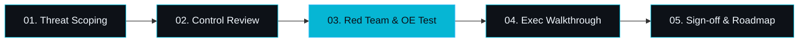

<h1 align="center">Hey there 👋, I'm Aayan</h1>
<h3 align="center">A passionate software engineer working on cybersecurity and data</h3>
<p align="left">  </p>
<br />

<div align="center">

# `nexus::secops` // AI Security & Cyber Governance

<p align="center">
  <a href="https://linkedin.com"></a>
  <a href="#focus"></a>
  <a href="#metrics"></a>
  <a href="#contact"></a>
</p>

```
[SYSTEM TELEMETRY]  CLEARANCE: TIER-3 // ISO-42001:2023 VALIDATED
ACTIVE DEFENSE:     OWASP LLM 01-10 ASSURANCE · RAG CONTEXT ISOLATION
TARGET SPEC:        ISO/IEC 42001 (AIMS) · NIST AI RMF · EU AI ACT
```

---

</div>

### `// 01. EXECUTIVE BRIEF`

> Enterprise **Cybersecurity Consultant** & qualified **ISO/IEC 42001:2023 AI Lead Implementer** specializing in algorithmic threat modeling, Artificial Intelligence Management Systems (AIMS), and control design / operational effectiveness (CD/OE) audits for Fortune 500 & scale-up infrastructure.

```yaml
tenure: "3+ Years Frontline Cyber & AI Governance"
accreditation: "ISO/IEC 42001:2023 Lead Implementer (AIMS)"
track_record: "50+ Enterprise Audits & Cloud Configuration Baseline Reviews"
readiness_rate: "100% Audit Readiness Across Engagements"
core_domains:
  - Enterprise AI Governance & Safety (LLM Red Teaming, NeMo/Llama Guard)
  - Application Security (SAST/DAST, API Vulnerability, Threat Modeling)
  - Cyber Risk & Controls (SOC 2, ISO 27001, NIST CSF, CD/OE Testing)
  - Cloud Posture Assurance (AWS/Azure/GCP CIS Benchmarks, Least Privilege)
```

---

### `// 02. AI SECURITY CONTROL MATRIX`

```
┌── L1: GOVERNANCE & ETHICS ────────────────────────────────────────────────────────┐
│   AIMS / ISO 42001 · Algorithmic Risk Inventory · Shadow AI Mitigation · EU AI Act│
├── L2: DATA & INGESTION ASSURANCE ─────────────────────────────────────────────────┤
│   Vector DB RBAC · Namespace Segregation · Poisoning Defense · Automated PII Sanit│
├── L3: RUNTIME & APPLICATION DEFENSE ──────────────────────────────────────────────┤
│   OWASP LLM Top 10 · Adversarial Jailbreak Defense · Guardrails · Context Isolation│
└── L4: INFRASTRUCTURE & INFERENCE ─────────────────────────────────────────────────┘
    GPU Cluster Enclaves · KMS Cryptographic Bounds · Terraform IaC Hardening
```

---

### `// 03. COMPLIANCE & VERIFICATION PIPELINE`



---

### `// 04. TELEMETRY POLICY CHECK`

```python
@audit_policy(ref="ISO42001:ANNEX_B.6.2", level="ENFORCED")
def verify_inference_payload(stream: InferenceStream, ctx: AuditContext) -> Signoff:
    return Signoff(
        jailbreak_risk = evaluate_adversarial_vector(stream.prompt) < 0.05,
        pii_leakage    = inspect_named_entities(stream.buffer) == 0,
        model_lineage  = ctx.provenance_token is not None,
        verdict        = "OPERATIONAL_EFFECTIVENESS_CONFIRMED"
    )
```

---

### `// 05. TECHNICAL STACK & CAPABILITIES`

```
CORE STANDARDS    ISO/IEC 42001 (AIMS) · NIST AI RMF · ISO 27001 · OWASP LLM 10 · CIS
AI DEFENSE        Llama Guard · NeMo Guardrails · Giskard · Custom Adversarial Evals
APP SEC / AUDIT   Semgrep · SonarQube · Burp Suite Pro · OWASP ZAP · Postman
CLOUD & IAC       AWS Security Hub · MSFT Defender · Terraform · tfsec · GCP SCC
```

---

### `// 06. CONNECT / VERIFIED ADVISORY`

<div align="center">

```
INQUIRIES: aayan.nayak2001@gmail.com
```

<p align="center">
  <a href="https://www.linkedin.com/in/aayan-n-921b2319b/"></a>
  &nbsp;
  <a href="https://github.com"></a>
  &nbsp;
</p>

<sub>Encrypted & Continuous Assurance · ISO/IEC 42001:2023 & NIST AI RMF Compliant</sub>

</div>
